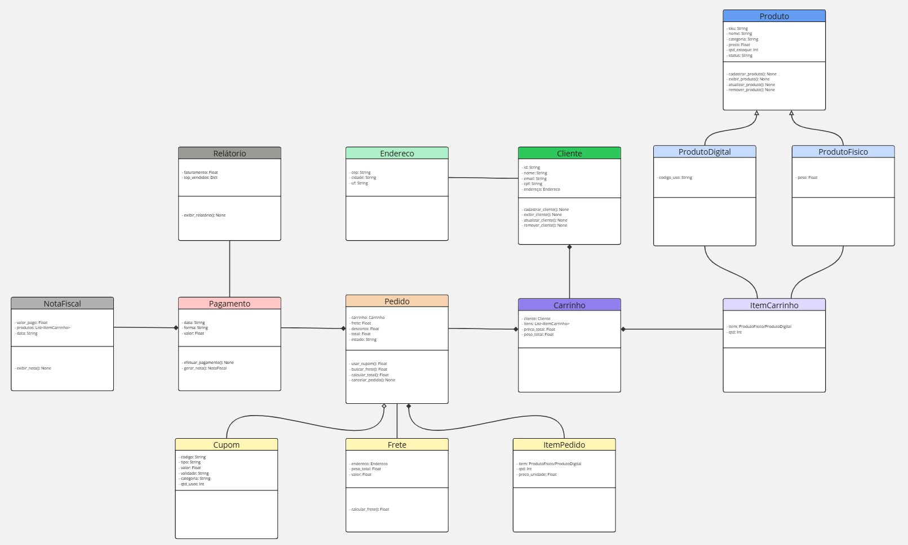

# SISTEMA DE LOJA VIRTUAL SIMPLIFICADA

## Descrição
O projeto Sistema de Loja Virtual Simplificada possibilita que um cliente cadastre-se ao informar alguns dados pessoais para fornecer a capacidade de adicionar produtos da loja dentro de um carrinho virtual, depois efetuar um pedido de pagamento, o qual pode receber descontos por cupons ou acréscimos devido ao frete. Por fim, o cliente recebe uma nota fiscal, enquanto o dono da loja tem acesso a um relatório das vendas.

## Objetivo
Criar um sistema que facilite o comércio físico e virtual ao automatizar, organizar e otimizar várias etapas de uma transação comercial, como a criação de relatórios de venda, a realização do pedido de compra e o pagamento e a alocação de produtos no carrinho. Assim, o sistema facilita a compra pelos clientes e a organização do comércio pelo comerciante.

# Lista das classes
1. Cliente
2. Produto
3. ProdutoDigital
4. ProdutoFisico
5. ItemCarrinho
6. Carrinho
7. Pedido
8. ItemPedido
9. Cupom
10. Pagamento
11. NotaFiscal
12. Relatorio
13. Endereco
14. Frete

# Diagrama de classes

### **Para uma visão mais detalhada, o [link](https://miro.com/app/board/uXjVHjQXB5Y=/?share_link_id=994540664978) de acesso do diagrama pelo Miro.**

# Classes detalhadas

- ## Cliente
    ### Atributos
    - id
    - nome
    - categoria
    - email
    - cpf
    - endereço (CEP, Cidade, UF)

    ### Métodos
    - cadastrar_cliente()
    - exibir_cliente()
    - atualizar_cliente()
    - remover_cliente()

- ## Produto
    ### Atributos
    - sku
    - nome
    - categoria
    - preço_unidade (>0)
    - qtd_stoque (>=0)
    - status

    ### Métodos
    - cadastrar_produto()
    - exibir_produto()
    - atualizar_produto()
    - remover_produto()

- ## ProdutoDigital
    ProdutoDigital -> Produto
    ### Atributos
    - codigo_uso

- ## ProdutoFisico
    ProdutoFisico -> Produto
    ### Atributos
    - peso

- ## ItemCarrinho
    ### Atributos
    - item
    - qtd

- ## Carrinho
    ### Atributos
    - cliente
    - itens
    - preco_total
    - peso_total

    ### Métodos
    - adicionar_carrinho()
    - remover_carrinho()
    - alterar_qtd_itens()

- ## Pedido
    ### Atributos
    - carrinho
    - frete
    - desconto
    - total
    - estado (CRIADO, PAGO, ENVIADO, ENTREGUE, CANCELADO)

    ### Métodos
    - cancelar_pedido() (somente se CRIADO ou PAGO)
    - buscar_frete()
    - usar_cupom()
    - calcular_total()

- ## ItemPedido
    ### Atributos
    - item
    - qtd
    - preco_unidade

- ## Cupom
    ### Atributos
    - codigo
    - tipo (Valor/Percentual)
    - valor
    - validade
    - categoria
    - qtd_usos

- ## Pagamento
    ### Atributos
    - data
    - forma (PIX, CREDITO, DEBITO, BOLETO)
    - valor

    ### Métodos
    - efetuar_pagamento() (Mudar o estado do Pedido para Pago)
    - gerar_nota()

- ## NotaFiscal
    ### Atributos
    - valor_pago
    - produtos
    - data
    
    ### Métodos
    - exibir_nota()

- ## Relatorio
    ### Atributos
    - faturamento
    - top_vendidos

    ### Métodos
    - exibir_relatório()

- ## Endereco
    ### Atributos
    - cep
    - cidade
    - uf

- ## Frete
    ### Atributos
    - endereco
    - peso_total
    - valor

    ### Métodos
    - calcular_frete()